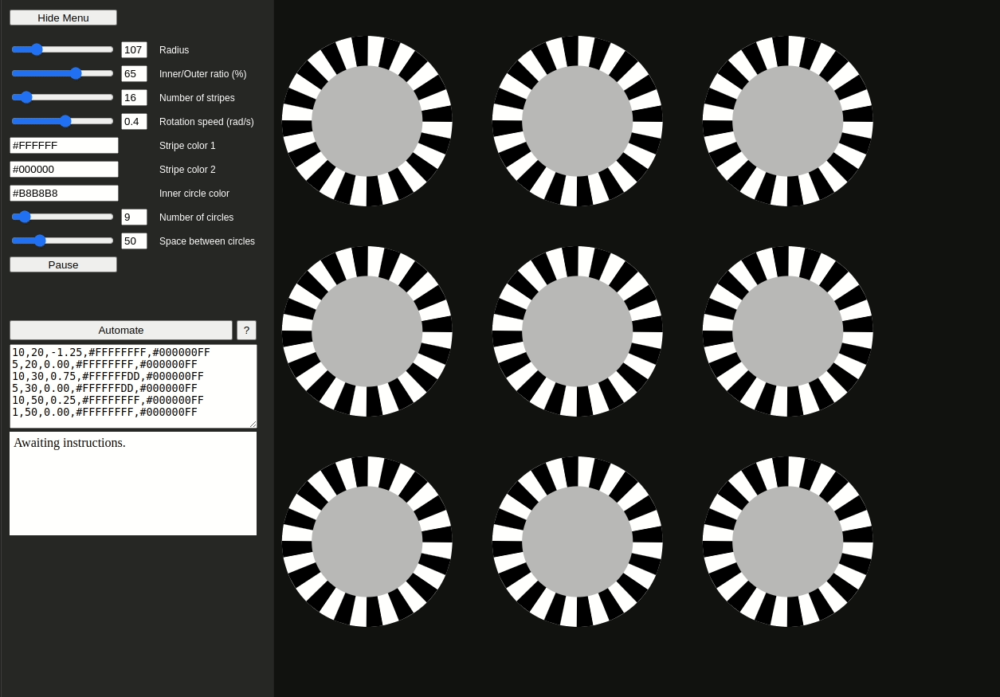

# Stripe Generator
A small web-app, which allows the user to customize spinning circles with a stripe pattern. 

Available at: https://dkalsan.github.io/stripe-generator/

# Functionality

*Note: The preview animation above looks choppy, because its smoothness is dependent on the machine running it (up to 60FPS).*

You can play around with the following parameters:
* **Radius** - Radius of the outer circle in pixels.
* **Inner/Outer ratio** - The ratio between the two circles in percent.
* **Number of stripes** - Number of even-sized stripes of each color.
* **Rotation speed (rad/s)** - Rotation speed in radians per second. The angle change is guaranteed, regardless of your machine's frame rate.
* **Stripe color 1** - Hex color of the first set of stripes.
* **Stripe color 2** - Hex color of the second set of stripes. In actuality, these are drawn over stripes of color 1, which are realized as a filled circle underneath). Hence, if you use transparency in your color setting, the two colors will mix.
* **Inner circle color** - Hex color of the inner circle.
* **Number of circles** - Number of drawn circles, which are all the same. A warning message is displayed, if not all circles can be drawn.
* **Space between circles** - Space in both directions between neighbouring circles in pixels.

Additional options:
* **Hide Menu** - Hides the menu to create additional drawing space. When you set the parameters, an info board appears stating whether all the circles will fit even after the menu is hidden.
* **Cache preset** - Caches your parameter settings in local storage, so that they persist over multiple sessions.
* **Pause/Resume** - Pauses and resumes animation.
* **Automation** - Enables you to preset a specific schedule of animations, which are run on Automate button press. This functionality is adapted from https://github.com/JunShern/fish-stripes/. Press the question mark button for information on how to write the scheduling commands.

# Caveats
* The app is tested on Chrome. It will still work in other browsers, but the UI might look out of place.
